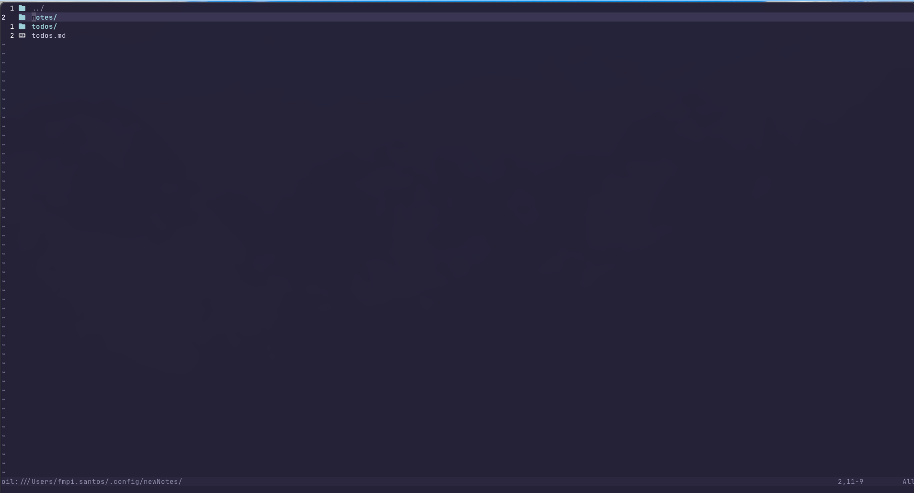
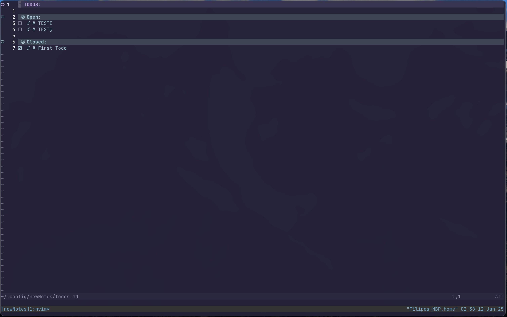
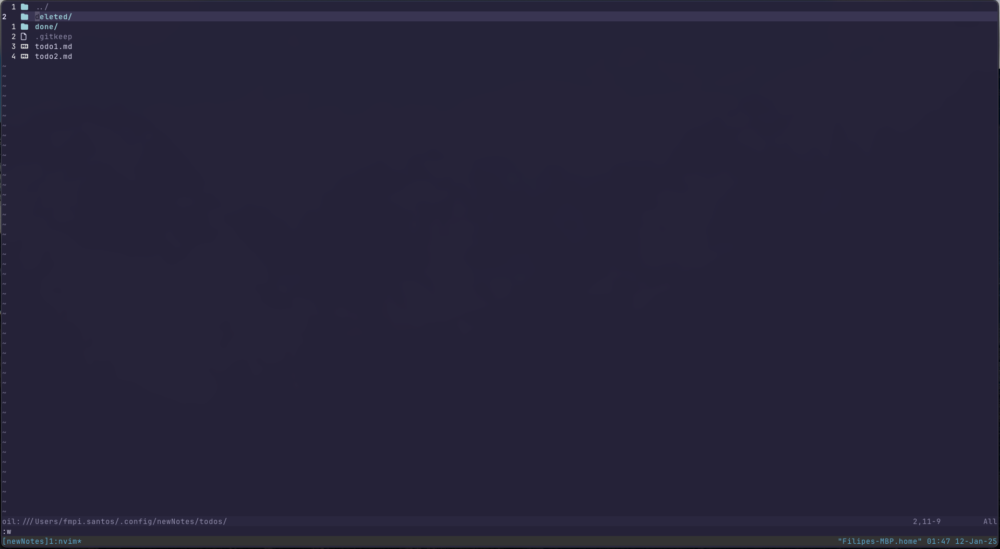
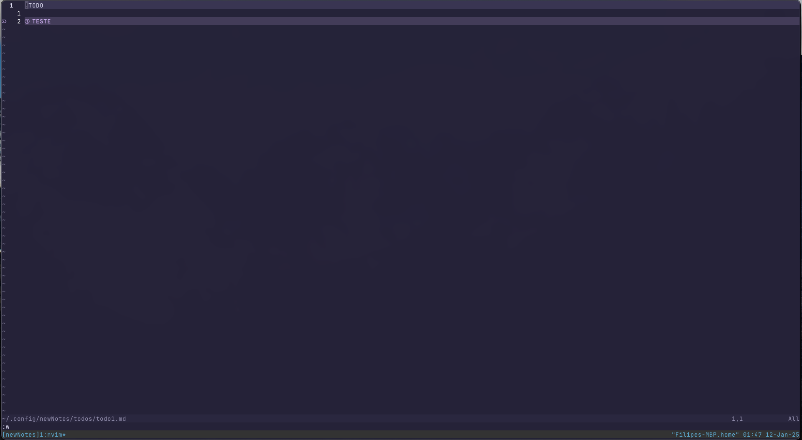

# Notes and Todos Setup for Neovim

This configuration provides a set of custom user commands and autocommands for managing notes and todos in Neovim. The setup leverages a Lua script to create commands and automatic behaviors related to note and todo management, such as opening files, adding new notes and todos, and refreshing the list when files are updated.

## Table of Contents

- [Dependencies](#dependencies)
- [Setup](#setup)
- [User Commands](#user-commands)
- [Autocommands](#autocommands)
- [Default keymaps](#default-keymaps)
- [Marks](#marks)
- [Functions Overview](#functions-overview)
- [Additional Configuration](#additional-configuration)
- [Bash Integration](#bash-integration)
- [Preview](#preview)


## Dependencies
### Oil.nvim 
[!Warning]
Remove this dependency
This plugin is used to manage file operations, such as moving files and updating content.
[!NOTE]
This plugin is not really necessary, was just used because I was using it at the time, if you want to remove it you can just replace the functions that use it with the default vim functions.

#### OilAutoCmd.nvim
This plugin is used to manage autocommands for files managed by the Oil plugin.

### Shared_Buffer.nvim
This plugin is used to share a buffer between multiple nvim sessions. (File based)

## Setup
### Lazy:

```lua
return {
    "fmpisantos/notes.nvim",
    dependencies = {
        "stevearc/oil.nvim",
        "fmpisantos/shared_buffer.nvim",
        "fmpisantos/oilAutoCmd.nvim"
    },
    config = function()
        require("notes").setup();
    end
}
```

## User Commands

These are custom commands that can be invoked by the user within Neovim:

1. **`:NotesSetup`**  
Initializes a new notes directory creating the necessary files and folders.

2. **`:NotesSetPath`** <a name="notessetpath"></a> </br>
Allows you to set a path as the notes directory. This can be useful when working with multiple notes directories or to transfer between devices. 

3. **`:Notes`**  
Opens the main notes directory in a popup window.

4. **`:Todos`**  
Opens the main todos directory in a popup window.

5. **`:GotoTodos`**  
Opens the todos.md file in the current buffer.

6. **`:GotoNotes`**
Opens the notes folder in the current buffer.

7. **`:Note`**  
Creates and opens a new note. The note's filename is based on the next available ID in the notes directory.

8. **`:Todo`**  
Opens a new todo file, allowing you to create and track tasks. Prefixing the new file with the [todo mark](#marks).

9. **`:TodosRefresh`**  
Regenerates the todos.md file based on the files locations.

## Autocommands
[!TIP]
The following autocommands are only setup for files in the [notes directory](#notessetpath):

1. **`BufWritePre`**  
This autocommand is triggered has a helper to know if the file being saved is a new file or an update to an existing one.

2. **`BufWritePost` (notes and todos)**  
This autocommand is triggered after writing a note or todo file:
   - This auto command is used to move the file to the correct location given its [todo mark](#marks).
   - It also updated the todos.md list of files.

3. **`BufDelete`**  
this auto command is triggered when a file is deleted. It is used to clean up the todos.md file.

### Todos.md autocommands
1. **`BufRead` and `BufNewFile`**  
This is used to setup the mappings for the todos.md file:
   - `gf` and `gd` are mapped to the `goto_file_in_todos_md` function to open the linked file from the todo.
   - `<Tab>` is mapped to `split_current_file` to split the window and open the todo file.
   - `<leader>n` is mapped to `add_todo` to add a new todo from within the todos file.

2. **`CursorMoved`**  
When the cursor moves within the todos.md file if the split_current_file is enabled (see point 1. <Tab>) 
the `update_split_content` function is triggered to update the content of a split window showing the todo details.

## Default keymaps
The following keymaps are setup by default when in the todos.md file:
   - `gf` and `gd` are mapped to the `goto_file_in_todos_md` function to open the linked file from the todo.
   - `<Tab>` is mapped to `split_current_file` to split the window and open the todo file.
   - `<leader>n` is mapped to `add_todo` to add a new todo from within the todos file.

## Marks
The following marks are used to categorize the state of the todo files. This marks are placed at the beginning of the file:
- `!TODO` - This mark is used to indicate that the file is a todo file.
- `!TODO(DONE)` - This mark is used to indicate that the file is a todo file and all tasks are done. (Also accepts: `!TODO (DONE)`, `!TODO(Done)`, `!TODO (Done)`)

## Functions Overview

The configuration relies on various utility functions to handle tasks like file operations, formatting, and updating content. Below are some of the key functions used in the configuration:

### `create_notes_directory`
This function is invoked when you run the `:NotesSetup` command. It sets up the notes directory structure if it doesn't already exist.

### `set_Path`
This function is triggered by the `:NotesSetPath` command to update the path where notes are stored.

### `open`
This function opens a given file. It's used to open notes or todo files.

### `open_new_todo`
This function opens a new todo file for creating a new task.

### `new_file`
This function creates a new file, which is triggered after a `BufWritePost` event when the file is new.

### `update`
This function updates the file content, triggered when an existing file is written.

### `refresh`
This function refreshes the notes or todos setup, invoked by the `:NotesRestart`, `:TodosRestart`, `:NotesRefresh`, or `:TodosRefresh` commands.

### `on_file_delete`
Triggered when a file is deleted, cleaning up any state related to the deleted file.

### `on_todos_md_updated`
Triggered after writing the todos file, this function updates the todos file by re-reading it.

### `get_next_id`
Generates the next available ID for a new note based on the current notes in the directory.

### `deserialize_todos_md_line`
Extracts and returns information from a line in the todos markdown file.

### `makeCamelCase`
Converts a title to CamelCase format, typically used for filenames or paths.

### `add_todo`
Prompts the user to enter a title for a new todo and creates a new todo file with the given title.

### `split_current_file`
Splits the current window and opens a todo file linked in the current line.

### `update_split_content`
Updates the content in a split window showing a todo file.

## Additional Configuration

### Oil AutoCMD Setup
The `oilAutoCMD.setup` function is used to set up additional behavior for files managed by the Oil plugin. Specifically:
- It handles file deletions, invoking the `on_file_delete` function.
- It manages file updates, invoking the `update_dont_open` function to update file state after a move operation, and it triggers `update_todos_md` to ensure the todos file is updated correctly.

## Bash Integration
The `notes` and `todos` commands can be used in the terminal to open the notes and todos directories in Neovim. 
To enable this functionality, add the following lines to your `.bashrc` or `.bash_profile`:

```bash
alias notes="nvim -c 'GotoNotes'"
alias note="nvim -c 'GotoNotes' -c 'Note'"
alias todo="nvim -c 'GotoTodos' -c 'Todo'"
alias todos="nvim +'GotoTodos'"
```

## Preview




